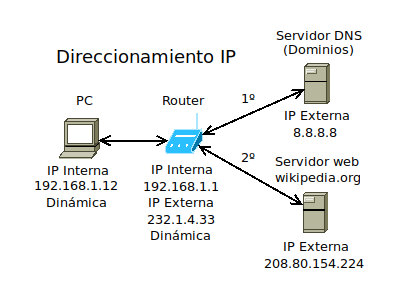

# Pruebas Markdown

Esto es un texto.

> Esto es un texto resaltado.

**Texto en negrita**

*Texto en cursiva*

Esto es `código`

```javascript
let variable = true;
```

## Enlaces



## Listas

### Listas desordenadas

- Item de la lista
- Otro item de la lista

### Listas ordenadas

1. Item ordenado
2. Otro item prdenado
3. Otro más...

[Índice](../README.md)

