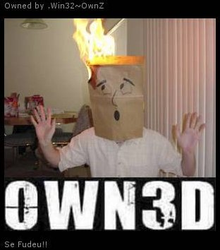
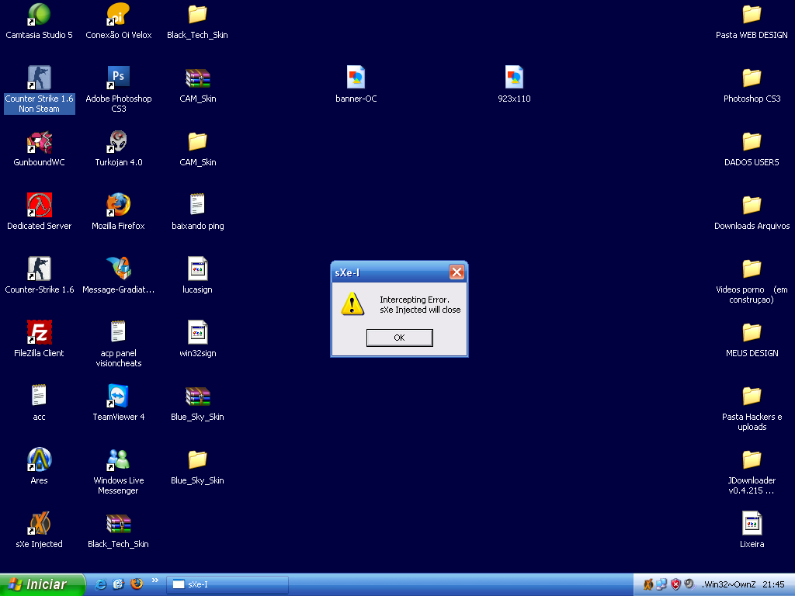

# El blog de «Redes» crackeado

Domingo, 11 de julio de 2009. 00:44 horas.

**Nota**: Algunos enlaces de este documento han dejado de funcionar. Se mantienen por su interés en la historia.

El sábado 11 de julio de 2009, a las 21:49, hora de España, según el propio *feed* del servicio, el blog «**REDES en la red**» del programa [REDES](http://www.redes.tve.es/) que Smartplanet elaboraba para [RTVE](http://www.rtve.es/) y que presentaba el divulgador [Eduard Punset](http://es.wikipedia.org/wiki/Eduardo_Punset), fue «crackeado» por alguien que accedió a él con el nombre de usuario «Bea Barco».

En el blog podía leerse la frase «HAHA -> Owned by .Win32~OwnZ Se Fudeu!!», y más abajo se leía «I’m From Brazil!! “copyright © 2009 Win32 all rights reserved”».

No parece ser un ataque dañino ni que existieran más desperfectos.

La dirección del blog en cuestión era : [http://www.smartplanet.es/redesblog/](http://www.smartplanet.es/redesblog/)

[Ver captura del blog crackeado.](blog.jpg)

Se avisó de lo ocurrido al administrador del blog a través de la única cuenta de correo encontrada.

Mediante el *feed* del blog, otros sitios han reflejado involuntariamente el ataque, como [Notas escritas por REDES en Facebook](http://es-la.facebook.com/notes.php?id=61160987336) y blogs que mostraron las noticias del blog de REDES en sus páginas.

## Tras la pista del «cracker»

Según la caché de Google, hay un perfil de «administrador» con el nombre del atacante en el foro de [www.radiostg.net](http://209.85.229.132/search?q=cache:IjbXDfjTAGQJ:www.radiostg.net/forum/index.php?showuser=7+.Win32%7EOwnZ&cd=20&hl=es&ct=clnk&gl=es) y otro de «root admin» en el sitio [www.wincheats.com](http://209.85.229.132/search?q=cache:J-Oe5L8SE6cJ:www.wincheats.com/index.php?showuser=1+.Win32%7EOwnZ&cd=33&hl=es&ct=clnk&gl=es), donde puede verse su contacto de msn: [win32@l2-fh.com](mailto:win32@l2-fh.com) e incluso hay unas [capturas de pantalla de su escritorio](http://209.85.229.132/search?q=cache:xOka58Xo_5MJ:www.wincheats.com/lofiversion/index.php/t301.html+site:www.wincheats.com+.Win32%7EOwnZ). :O

Tirando de correo, encontramos también sus perfiles de [http://cheatsadvanced.net](http://cheatsadvanced.net/forum/index.php?showuser=6) y [www.powercheats.com.br](http://www.powercheats.com.br/forum/index.php?showuser=92973).

El dominio «l2-fh.com» devuelve la siguiente información en [aboutus.com](http://www.aboutus.org/L2-fh.com) donde puede leerse el lema de estos «hackers»: «L2-FH.COM - FACA SUA GUERRA!»

Aquí el [whois con los datos del dominio](http://whois.domaintools.com/l2-fh.com), en el que consta el propietario, su correo electrónico y teléfono.

Si bien no hay certeza de que esta sea la persona en cuestión, no es aventurado pensar que está directamente relacionado con el autor y/o con los grupos «hackers» que esa persona visita, como [http://www.forum-hacker.com.br](http://www.forum-hacker.com.br/) (un dominio que también parece ser de este registrador, según aboutus.com), pues es el propietario del dominio del correo del atacante. De ser él la propia persona implicada, se trataría, según la información que hay en la red, de alguien muy joven, un [*lammer*](http://es.wikipedia.org/wiki/Lammer) explotando cualquier vulnerabilidad software conocida del blog sin otra intención que la de divertirse.

La foto que aparece en uno de las dos entradas realizadas por el atacante, y que ilustra esta noticia, es un [*hotlink*](https://es.wikipedia.org/wiki/Hotlinking) que conduce a un curioso blog llamado [BANARDICES](http://banardices.wordpress.com/) .Aunque pudiera ser el blog del propio autor del «crackeo», más bien parece que únicamente una de sus fotos fue usada para el ataque.

## Seguimiento

#### 19:29 del domingo 12
A las 2:11, según el feed, el blog de Punset fue actualizado. A esas horas ya se había producido el ataque.

#### 00:25 del lunes 13
Desaparecen los post del crackeo del blog, que se restaura a su estado del sábado.

#### 13:51 del martes 14
En el sitio [Notas escritas por REDES en Facebook](http://es-la.facebook.com/notes.php?id=61160987336) siguieron sin limpiarse las entradas automáticas que dejó el feed RSS. Pudiera ser que esta página en Facebook no estuviera directamente relacionada con Smartplanet.
