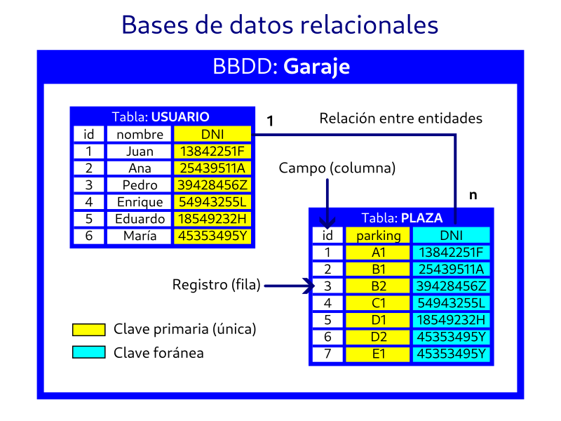

# Sesión 7: «Relaciones»

Qué haremos hoy:
- Teoría
- Práctica

### 09:30 (1h 30min) Teoría  

- Relaciones (número de entidades con las que se relaciona una entidad)  

| Tipo | Definición |
| --- | --- |
| **1:1** | Uno a uno |
| **1:n** | Uno a varios |
| **n:1** | Varios a uno |
| **n:m** | Varios a varios |

- Estructuras de datos: conceptos de relacional y documental.  
https://es.wikipedia.org/wiki/Base_de_datos_relacional  
https://es.wikipedia.org/wiki/Base_de_datos_documental  
https://es.wikipedia.org/wiki/Sistema_de_gesti%C3%B3n_de_bases_de_datos  

- Ejercicio. Debate: ¿Es la WWW una gran base de datos documental?

- SQL (definición)  
https://es.wikipedia.org/wiki/SQL  

- SQL vs. NoSQL
https://openwebinars.net/blog/sql-vs-nosql-comparativa-para-elegir-correctamente/  

- SGBD: MySQL MariaDB PostgreSQL, SQLite, Oracle, Microsoft SQL Server
MongoDB, Redis, Casandra  
https://www.inesem.es/revistadigital/informatica-y-tics/los-gestores-de-bases-de-datos-mas-usados/  

**Recomendaciones de material complementario para divertirse:**  
Aprende SQL desde cero  
https://www.sql-easy.com/es/  
DB Browser for SQLite  
https://sqlitebrowser.org/  
Ejemplo BBDD con una tabla: [ejemplo.sqlite](../recursos/ejemplo.sqlite)

### 11:30 (30 min) Descanso

### 11:50 (1h 30min) Práctica

- La shell bash  
- La terminal de Linux: https://axarnet.es/blog/comandos-linux

### 13:30 finalización de la sesión

[Índice](../README.md)